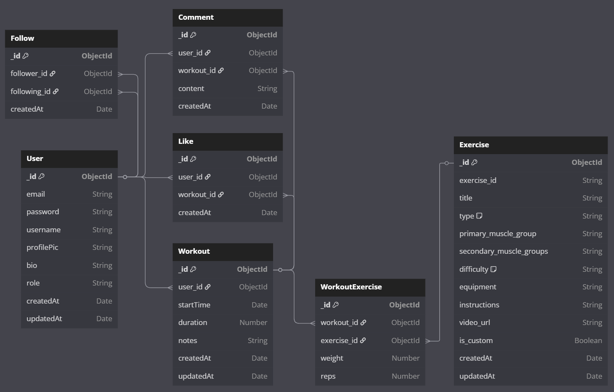

# Ziutki Gym - Workout Management Application

## Project Description

Ziutki Gym is a full-featured web application designed to empower users to take control of their fitness journey.

**Key Features:**

* **Secure User Authentication:**
    * Robust user registration, login, and account management.
    * Password hashing for enhanced security.
    * Session-based authentication using JWT (JSON Web Tokens).
* **Customizable Workout Routines:**
    * Intuitive interface for creating personalized workout plans.
    * Selection of exercises from a comprehensive library.
    * Specification of sets, repetitions, and weights for each exercise.
* **Detailed Workout Logging:**
    * Precise tracking of workout start and end times.
    * Automatic calculation of workout duration.
    * Option to add notes and observations to each workout session.
* **Exercise Library Management:**
    * Predefined catalog of exercises with details like title, type, muscle groups, difficulty, equipment, and instructions.
    * Support for adding custom exercises (future enhancement).
* **Social Interaction and Community:**
    * User following system to connect with other users.
    * Ability to view the workout activity feed of followed users.
* **User Profiles and Progress Tracking:**
    * Personalized user profiles to display workout history and fitness statistics.
    * Likely future enhancements: visualization of progress through charts and graphs.
* **Administrative Control:**
    * Admin panel for managing user accounts, roles, and system settings.
    * User management (create, edit, delete).

* **Frontend (React):**
    * Responsible for presenting the user interface, handling user interactions, and displaying data.
    * Utilizes React Router for navigation between different pages/sections.
    * Manages application state using a state management library (Zustand).
    * Communicates with the backend API using HTTP requests (Axios).
* **Backend (Node.js/Express):**
    * Acts as the server-side application logic, handling requests from the frontend and interacting with the database.
    * Provides API endpoints for data retrieval and manipulation.
    * Uses controllers to manage specific API routes and logic.
    * Employs middleware for tasks like request processing, error handling, and security.
    * Handles user authentication and authorization using JWT.
    * Performs data validation to ensure data integrity.
* **Data Store (MongoDB):**
    * A NoSQL database used to store application data.
    * Data is organized into collections, such as:
        * `User`: Stores user information.
        * `Workout`: Stores details about workout sessions.
        * `Exercise`: Contains information about available exercises.
        * `Follow`: Manages user follower/following relationships.
        * `Comment`: Stores comments on workouts.
        * `Like`: Tracks user likes on workouts.

## Architecture Diagram

The "Ziutki Gym" application is built using a client-server architecture with an additional worker component (consumer) to handle asynchronous tasks, such as sending welcome emails. The entire system is managed and run using Docker Compose.

### Main Components:

1.  **User (Web Browser):** User interface for interacting with the application.
2.  **Frontend (React/Vite):** Client-side application built with React (using Vite), responsible for rendering the UI and communicating with the backend API.
3.  **Backend API (Node.js/Express):** Server-side application handling business logic, data management, and providing a REST API for the frontend.
4.  **Database (MongoDB):** NoSQL database used to store application data (users, workouts, exercises, etc.).
5.  **RabbitMQ (Message Broker):** Used for handling asynchronous tasks, such as sending welcome emails after user registration.
6.  **Consumer (Node.js Worker):** Separate Node.js process that consumes messages from RabbitMQ and performs actions (e.g., sending emails via Nodemailer).
7.  **Cloudinary (External Service):** External service for storing and delivering images like user avatars.
8.  **SMTP Server (External Service):** External service used by the Consumer for sending emails.

### Text Diagram:

```
                                  +---------------------------------+
                                  |        User (Web Browser)       |
                                  +----------------+----------------+
                                                   | (HTTPS)
                                                   v
                               +-------------------------------------+
                               |        Frontend (React / Vite)      |
                               |    (Zustand, React Router, Axios)   |
                               +-------------------+-----------------+
                                                   | (HTTP/REST API Calls, JWT Auth)
                                                   v
+---------------------------------------------------------------------------------------------------------+
|                                       Backend Infrastructure                                            |
|                                                                                                         |
|    +--------------------------+      +---------------------------+      +---------------------------+   |
|    |       Backend API        |----->|    Database (MongoDB)     |      |        Cloudinary         |   |
|    |    (Node.js / Express)   |<-----|     (Data Storage)        |<-----| (External Image Service)  |   |
|    +-----------+--------------+      +---------------------------+      +---------------------------+   |
|                |                                                                                        |
|                v                                                                                        |
|    +-----------+--------------+      +---------------------------+                                      |
|    |        RabbitMQ          |----->|     Consumer (Node.js)    |                                      |
|    |     (Message Broker)     |      |      (Email Worker)       |                                      |
|    +--------------------------+      +-----------+---------------+                                      |
|                                                  | (SMTP)                                               |
|                                                  v                                                      |
|                                      +-----------+---------------+                                      |
|                                      |      SMTP Server          |                                      |
|                                      | (External Email Service)  |                                      |
|                                      +---------------------------+                                      |
|                                                                                                         |
+---------------------------------------------------------------------------------------------------------+
```

## Database Schema



## Setup Instructions

This project is most easily set up using Docker Compose. This method will build and run all necessary components (backend & frontend).

1.  **Clone the repository:**
    * Open your terminal or command prompt.
    * Use Git to clone the project repository to your local machine.
        ```bash
        git clone github.com/basiagaoskar/gym-app
        cd gym-app  # Navigate into the project directory
        ```

2.  **Run Docker Compose:**

    * Execute the following command:

        ```bash
        docker-compose up --build
        ```

3.  **Access the application:**

    * Frontend: `http://localhost:5173`
        * Once the frontend container is running, you can access the user interface of the application by opening this URL in your web browser.
    * Backend API: `http://localhost:5001/api`
        * The backend API is available at this URL. This is where the frontend sends requests to retrieve data, create users, manage workouts, and perform other operations.

## Technologies Used

* **Node.js:**
    * A JavaScript runtime environment that executes JavaScript code server-side.
    * **Justification:** Node.js's non-blocking, event-driven architecture makes it highly efficient for handling concurrent requests, which is crucial for a web application that serves multiple users simultaneously. Its extensive ecosystem of packages and libraries simplifies development.
* **Express:**
    * A lightweight and flexible Node.js web application framework.
    * **Justification:** Express provides a robust set of features for building web applications and APIs, including routing, middleware support, request and response handling, and template engines. It simplifies development and promotes code organization.
* **React:**
    * A JavaScript library for building user interfaces (UIs).
    * **Justification:** React's component-based architecture enables the creation of reusable UI elements, making development more efficient and maintainable.  Its virtual DOM and efficient updating mechanism contribute to a smooth and responsive user experience.
* **Tailwind CSS:**
    * A utility-first CSS framework that allows developers to style web applications by composing pre-defined CSS classes.
    * **Justification:** Tailwind CSS enables rapid UI development by providing a comprehensive set of building blocks. It promotes consistency in design and simplifies the process of creating responsive layouts.
* **MongoDB:**
    * A NoSQL database that stores data in flexible, JSON-like documents.
    * **Justification:** MongoDB's schema-less nature allows for greater flexibility in handling evolving data structures, which can be advantageous in the early stages of development. Its scalability and performance are well-suited for handling the data generated by users and workouts.
* **Docker Compose:**
    * A tool for defining and running multi-container Docker applications.
    * **Justification:** Docker Compose simplifies the setup and deployment of the application by allowing all services to be defined in a single configuration file (`docker-compose.yml`). This ensures consistent environments across development, testing, and production, reducing the risk of "it works on my machine" issues. It also makes it easier to manage dependencies and scale the application.

## Additional Notes

* **Backend API Documentation:**
    * The backend API documentation is automatically generated using Swagger.
    * It provides a comprehensive reference for all available API endpoints, including request methods, parameters, request bodies, response formats, and authentication/authorization requirements.
    * Access the documentation by navigating to `http://localhost:5001/api/docs` in the web browser while the application is running.

* **Backend Environment Variables:**
    * Environment variables for the backend are loaded from a `.env` file located in the `backend/` directory.
    * These variables are used to configure sensitive information and settings, such as:
        * `MONGO_URI`: The connection string for the MongoDB database.
        * `JWT_SECRET`: A secret key used to sign and verify JSON Web Tokens for authentication.
        * `CLOUDINARY_CLOUD_NAME`, `CLOUDINARY_API_KEY`, `CLOUDINARY_API_SECRET`: Credentials for the Cloudinary service (image uploads).
        * `PORT`: The port on which the backend server listens for requests.
        * `SMTP_HOST`: SMTP host for sending emails (e.g., `smtp.ethereal.email`).
        * `SMTP_USER`: Username for SMTP authentication.
        * `SMTP_PASS`: Password for SMTP authentication.
    * Location:
        * `backend/src/lib/db.js` (MongoDB connection uses `MONGO_URI`)
        * `backend/src/services/auth.service.js` (JWT signing uses `JWT_SECRET`)
        * `backend/src/lib/cloudinary.js` (Cloudinary configuration uses `CLOUDINARY_*` variables)
        * `backend/src/services/email.service.js` or `backend/src/user.consumer.js` (Email sending uses `SMTP_*` variables)

* **Backend Testing:**
    * The backend includes unit tests written using the Jest testing framework.
    * These tests are located in the `backend/__tests__/` directory.
    * The test environment is configured using the `NODE_ENV` environment variable. When `NODE_ENV` is set to `'test'`, the application runs in a testing mode.
   * To run the tests, first navigate to the backend directory, and then use the following npm script (defined in `backend/package.json`):
        ```bash
        cd backend
        npm run test
        ```
